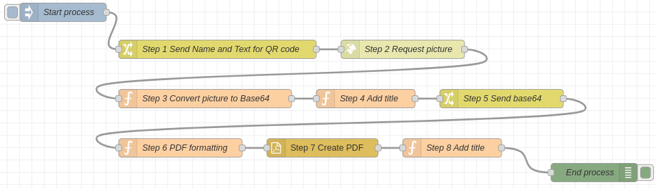

Fork of the node-red-contrib-pdfmake package with error handling, fixed crashes and updated pdfmake library (ver. 0.3.8(beta))
[node-red-contrib-pdfmake repository](https://github.com/ollixx/node-red-contrib-pdfmake.git)

# @platmac/node-red-pdfbuilder
This node is a simple wrapper around pdfmake, a JSON based solution to create PDFs from a given document definition.

[pdfmake website](http://pdfmake.org/#/)

## Use Cases

Use cases where PDF generation might be necessary:
* **Business Reports and Analysis:**
* Monthly or quarterly financial reports.
* Annual performance analysis.
* Sales and revenue reports.
* **Legal Documents:**
* Contracts and agreements.
* Non-disclosure agreements (NDAs).
* Legal briefs and case summaries.
* **Educational Materials:**
* Course syllabi and lecture notes.
* Research papers and thesis documents.
* Certificates and diplomas.
* **Marketing Materials:**
* Brochures and flyers.
* Product catalogs and price lists.
* Newsletters and promotional emails.
* **Invoices and Receipts:**
* Automated invoice generation for services and products.
* Receipts for online and offline purchases.
* Billing statements for subscription services.
* **Event Management:**
* Tickets and passes for events.
* Event schedules and programs.
* Certificates of attendance.
* **HR and Employee Documentation:**
* Employment contracts and offer letters.
* Performance reviews and feedback forms.
* Training manuals and onboarding documents.
* **Customer Communication:**
* Customized proposals and quotes.
* Order confirmations and shipping notices.
* Customer service reports and summaries.
* **Government and Public Services:**
* Official forms and applications.
* Licenses and permits.
* Public notices and bulletins.
* **Technical Documentation:**
* User manuals and guides.
* System specifications and requirements.
* Software documentation and release notes.

## Install
@platmac/node-red-pdfbuilder can be install using the node-red editor's pallete or by running npm in the console:

``` bash
npm install @platmac/node-red-pdfbuilder
```

## Usage
Instructions of how to describe document you can find at pdfmake website, documentation section.

[pdfmake website doc](https://pdfmake.github.io/docs/0.3/document-definition-object/) 

There is just one node, and it expects an object in ```msg.payload``` with a valid docDefinition like:
``` json
{ 
	"content": [
		"First paragraph",
		"Another paragraph, this time a little bit longer to make sure, this line will be divided into at least two lines"
	]
	
}
```

The following properties can be configured in the node editor:
* **Input property:** Define the property of object which will be used for pdf generation.
* **Options:** Table layout properties. Full description can be found at [pdfmake doc, tables page](https://pdfmake.github.io/docs/0.1/document-definition-object/tables/).
* **Output type:** Select the type of generation (Base 64 or Buffer).
* **Output property:** Define the property of object where generated pdf will be saved.

The node returns a ```msg.payload``` holding the created PDF either as a Buffer or a base64 encoded string (as configured in the node).

## Examples
Examples are provided using the default node-red way, i.e. use ```import``` in the editor menu and look for examples in the ```@platmac/node-red-pdfbuilder``` package

